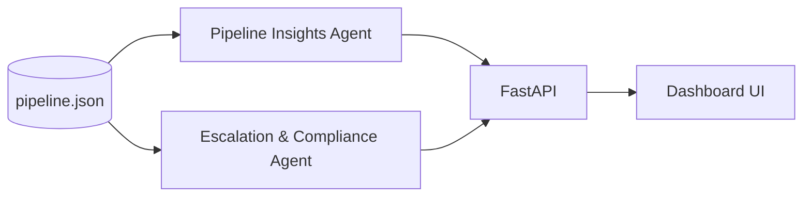

# Agent Design — Pipeline Insights & Escalation/Compliance

## Context

Part of the **Agentic AI Recruitment Process Support System** for TalentBridge Staffing Solutions. These two agents consume shared pipeline data (`data/pipeline.json`) and produce structured JSON for the recruiter dashboard and API consumers.

## Pipeline Insights Agent

### Inputs
- Requisitions with candidates, stages, SLAs, flags, pending actions
- Optional filter: `requisition_id`

### Outputs
| Field | Purpose |
|-------|---------|
| `executive_summary` | Narrative overview for recruiters/HMs |
| `role_wise_status` | Per-role health, stage breakdown, oldest-in-stage |
| `stage_distribution` | Counts by hiring stage |
| `bottlenecks` | Stage congestion, recruiter capacity, blocked reqs |
| `aging_applications` | Candidates over SLA with days-over metrics |
| `priority_actions` | Sorted pending tasks by urgency |
| `metrics` | SLA breach rate, avg days in stage, roles at risk |

### Bottleneck Types
1. **stage_congestion** — Multiple candidates in a stage exceeding ~80% of SLA
2. **recruiter_capacity** — Recruiter with 4+ active candidates in scope
3. **requisition_blocked** — On-hold requisition with active candidates

### Role Health
- `healthy` — No SLA issues
- `watch` — At least one aging candidate
- `at_risk` — Requisition on hold
- `critical` — 50%+ candidates aging or 2+ aging

---

## Escalation and Compliance Agent

### Inputs
- Same pipeline data + `compliance_policies`
- Candidate `flags`, scores, stages

### Outputs
| Field | Purpose |
|-------|---------|
| `escalation_queue` | Cases requiring human review |
| `fairness_checks` | Process uniformity & score/stage consistency |
| `policy_reminders` | Active policies for current escalations |
| `audit_recommendations` | Action items for compliance logging |

### Escalation Rules (demo)
| Flag | Severity | Auto-hold |
|------|----------|-----------|
| `compliance_review` | critical | yes |
| `protected_class_note` | high | yes |
| `stale_requisition` | high | yes |
| `offer_delay` | medium | no |
| `feedback_pending` | medium | no |

Additional triggers:
- **Score anomaly** — Candidate score deviates ≥25 points from role average
- **Offer/background stage** — Monitoring escalation per adverse-action policy

### Fairness Checks
- All candidates stuck in same stage → process uniformity warning
- Lower-scored candidates advanced ahead of higher scores → consistency review

---

## Interaction Flow

Recruiters use **Pipeline Insights** for daily prioritization and **Escalation & Compliance** for cases that must not proceed without approval.

## Success Criteria Mapping

| Capstone Criterion | How This Prototype Addresses It |
|--------------------|----------------------------------|
| Pipeline visibility | Role table, stage distribution, metrics |
| Bottleneck detection | Bottleneck analysis + recruiter load |
| Aging applications | SLA comparison + aging list |
| Escalate sensitive cases | Escalation queue with severity & auto-hold |
| Compliance/fairness | Policies, fairness checks, audit recommendations |
| Human-in-the-loop | All escalations `pending_human_review` |
